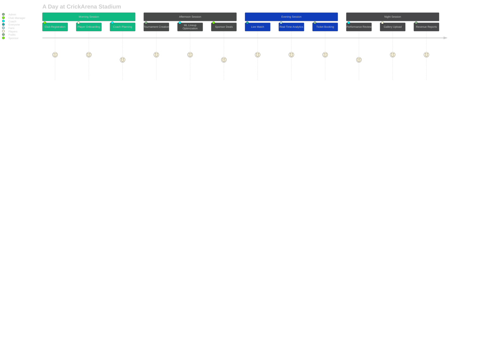
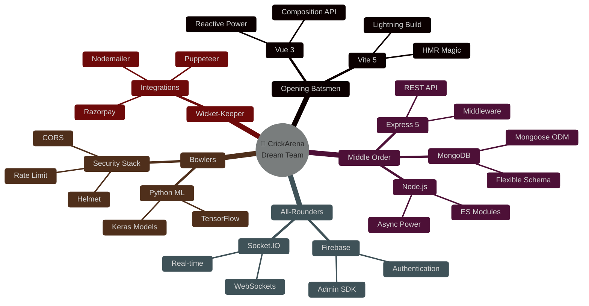
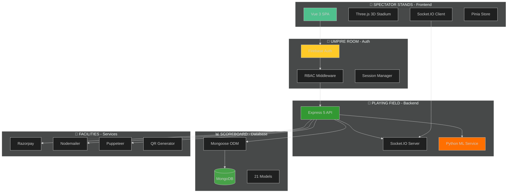
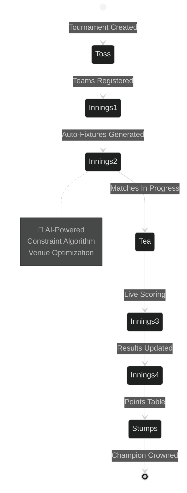
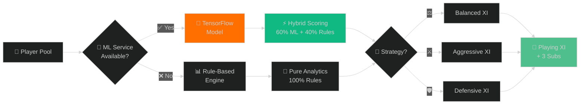
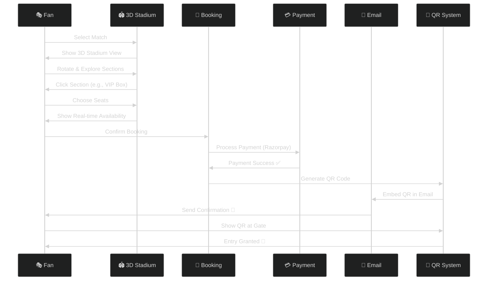

<div align="center">

<!-- Stadium Entrance -->


<!-- Stadium Scoreboard -->


<!-- Match Status Board -->
<table>
<tr>
<td align="center">

</td>
<td align="center">

</td>
<td align="center">

</td>
</tr>
</table>

<!-- Live Scoreboard -->
```
╔══════════════════════════════════════════════════════════════════════╗
║                    🏏 LIVE SCOREBOARD 🏏                             ║
╠══════════════════════════════════════════════════════════════════════╣
║  TEAM CRICKARENA          21 Models  |  19 Routes  |  ∞ Possibilities║
║  OVERS: Continuous        RUN RATE: ⚡ Lightning Fast                ║
║  PARTNERSHIPS: Vue.js 🤝 Node.js 🤝 MongoDB 🤝 ML                   ║
║  CURRENT BATSMEN: Innovation & Technology at the crease             ║
╚══════════════════════════════════════════════════════════════════════╝
```

<!-- Stadium Sections (Navigation) -->


## �️ STADIUM SEATING CHART - CHOOSE YOUR SECTION

<table>
<tr>
<td align="center" width="20%">
<a href="#-pavilion-overview">
<br/>
<b>🏛️ PAVILION</b><br/>
<sub>Overview & Vision</sub>
</a>
</td>
<td align="center" width="20%">
<a href="#-players-dugout">
<br/>
<b>👥 PLAYERS DUGOUT</b><br/>
<sub>Tech Stack</sub>
</a>
</td>
<td align="center" width="20%">
<a href="#-commentary-box">
<br/>
<b>🎙️ COMMENTARY BOX</b><br/>
<sub>Features</sub>
</a>
</td>
<td align="center" width="20%">
<a href="#-vip-lounge">
<br/>
<b>👑 VIP LOUNGE</b><br/>
<sub>Roles & Access</sub>
</a>
</td>
<td align="center" width="20%">
<a href="#-ticket-counter">
<br/>
<b>🎫 TICKET COUNTER</b><br/>
<sub>Quick Start</sub>
</a>
</td>
</tr>
</table>


</div>

<br/>


## 🏛️ PAVILION - OVERVIEW

<div align="center">

```
                    🏏 WELCOME TO THE PAVILION 🏏
    
    ┌─────────────────────────────────────────────────────────┐
    │                                                         │
    │   "Where Tradition Meets Innovation"                   │
    │                                                         │
    │   Est. 2024 | Kerala's Premier Digital Stadium        │
    │                                                         │
    └─────────────────────────────────────────────────────────┘
```

</div>

### 📜 THE MATCH REPORT

> **CrickArena** is Kerala's first **digital cricket stadium** - a revolutionary platform that transforms grassroots cricket from paper-based chaos into an intelligent, cloud-powered ecosystem. Think of it as building a **world-class cricket stadium in the cloud**, where every stakeholder has a premium seat.

<table>
<tr>
<td width="50%">

### 🎯 THE PITCH CONDITION

```diff
! BEFORE CRICKARENA (The Dark Ages)
- 📄 Paper-based registrations
- 📞 Phone call scheduling
- 📊 No performance data
- 🤷 Disconnected stakeholders
- 💸 Lost sponsorship opportunities
- 🎫 Manual ticket sales
- ❌ Zero analytics
```

</td>
<td width="50%">

### ✨ AFTER CRICKARENA (The Golden Era)

```diff
+ 🌐 Digital club ecosystem
+ 🤖 AI-powered scheduling
+ 📊 ML-driven insights
+ 🤝 Connected community
+ 💼 Sponsor marketplace
+ 🎫 Smart ticketing + QR
+ 📈 Real-time analytics
```

</td>
</tr>
</table>

<div align="center">

### 🏆 TROPHY CABINET (Platform Stats)

<table>
<tr>
<td align="center">
<br/>
<b>21 MODELS</b><br/>
<sub>Database Champions</sub>
</td>
<td align="center">
<br/>
<b>19 ROUTES</b><br/>
<sub>API Pathways</sub>
</td>
<td align="center">
<br/>
<b>ML POWERED</b><br/>
<sub>Smart Decisions</sub>
</td>
<td align="center">
<br/>
<b>&lt;50ms</b><br/>
<sub>Lightning Fast</sub>
</td>
<td align="center">
<br/>
<b>7 LAYERS</b><br/>
<sub>Fort Knox Security</sub>
</td>
</tr>
</table>

### 🎬 MATCH HIGHLIGHTS



</div>

<details open>
<summary><h3>🎯 GROUND RULES (Core Features)</h3></summary>

<br/>

<table>
<tr>
<td align="center" width="25%">
<br/>
<b>🏆 TOURNAMENT ENGINE</b><br/>
<sub>⚡ Auto-scheduling<br/>🎲 3 formats<br/>📊 Live updates</sub>
</td>
<td align="center" width="25%">
<br/>
<b>🤖 ML OPTIMIZER</b><br/>
<sub>🧠 60% ML + 40% Rules<br/>🎯 3 strategies<br/>⚡ 40-80ms</sub>
</td>
<td align="center" width="25%">
<br/>
<b>🏟️ 3D STADIUM</b><br/>
<sub>🎨 Interactive viz<br/>🎫 Smart ticketing<br/>📱 QR validation</sub>
</td>
<td align="center" width="25%">
<br/>
<b>📊 LIVE ANALYTICS</b><br/>
<sub>🎯 Win probability<br/>📈 Momentum<br/>🤖 AI insights</sub>
</td>
</tr>
<tr>
<td align="center" width="25%">
<br/>
<b>🤝 SPONSORSHIP</b><br/>
<sub>💎 4-tier packages<br/>📝 E-signatures<br/>💰 Payment tracking</sub>
</td>
<td align="center" width="25%">
<br/>
<b>📸 GALLERY</b><br/>
<sub>🖼️ Photo uploads<br/>✅ Moderation<br/>⭐ Featured content</sub>
</td>
<td align="center" width="25%">
<br/>
<b>💬 MESSAGING</b><br/>
<sub>📡 Real-time chat<br/>🤝 Negotiations<br/>📱 Notifications</sub>
</td>
<td align="center" width="25%">
<br/>
<b>🔒 SECURITY</b><br/>
<sub>🔥 Firebase Auth<br/>🛡️ RBAC<br/>🔐 7 layers</sub>
</td>
</tr>
</table>

</details>

<br/>


<br/>


## 👥 PLAYERS DUGOUT - TECH STACK

<div align="center">

```
    🏏 MEET THE PLAYING XI 🏏
    
    ┌──────────────────────────────────────────┐
    │  "Every Great Team Needs Great Players"  │
    │   Our Tech Stack - The Dream Team        │
    └──────────────────────────────────────────┘
```

### 🎯 TEAM LINEUP



</div>

<table>
<tr>
<td width="33%" valign="top">

### 🏏 OPENING PAIR (Frontend)

<div align="center">
<br/>
</div>

```yaml
🎯 BATSMAN 1: Vue 3
  Role: Captain & Opener
  Strength: Composition API
  Special: Reactive Magic
  Strike Rate: ⚡ Lightning
  
🎯 BATSMAN 2: Vite 5
  Role: Vice-Captain
  Strength: Build Speed
  Special: HMR < 500ms
  Strike Rate: 🚀 Supersonic
```

**🏆 BATTING STATS:**
- ⚡ Hot Module Replacement
- 🎨 Tailwind CSS 3
- 🎮 Three.js 3D Graphics
- 📊 Chart.js Visualization
- 🍍 Pinia State Management
- 🗺️ Vue Router 4

</td>
<td width="33%" valign="top">

### 🎯 MIDDLE ORDER (Backend)

<div align="center">
<br/>
</div>

```yaml
🎯 BATSMAN 3: Node.js
  Role: Anchor
  Strength: ES Modules
  Special: Async/Await
  Strike Rate: 🔥 Consistent
  
🎯 BATSMAN 4: Express 5
  Role: Finisher
  Strength: Middleware
  Special: REST API
  Strike Rate: 💪 Powerful
```

**🏆 BATTING STATS:**
- 🚀 19 API Routes
- 📊 21 Data Models
- 🤖 Python ML Service
- 📡 Socket.IO Server
- 🔐 Firebase Admin
- ⚡ Rate Limiting

</td>
<td width="33%" valign="top">

### 🎳 BOWLING ATTACK (Security)

<div align="center">
<br/>

</div>

```yaml
🎳 BOWLER 1: Firebase Auth
  Role: Opening Bowler
  Strength: OAuth Magic
  Special: Token Verify
  Economy: 🛡️ Unbreakable
  
🎳 BOWLER 2: Security Stack
  Role: Death Bowler
  Strength: 7 Layers
  Special: Fort Knox
  Economy: 🔒 Impenetrable
```

**🏆 BOWLING STATS:**
- 🔥 Firebase Authentication
- 🛡️ Helmet + CORS
- 🔐 RBAC Middleware
- ✅ Joi Validation
- ⚡ Rate Limiting
- 🍪 HTTP-only Cookies

</td>
</tr>
</table>

<div align="center">

### 🏟️ STADIUM ARCHITECTURE



### 🏆 TEAM STATISTICS


</div>

<br/>


<br/>


## 🎙️ COMMENTARY BOX - FEATURES

<div align="center">

```
    🎙️ LIVE COMMENTARY 🎙️
    
    "And here comes CrickArena with an array of features
     that would make any cricket management platform jealous!"
```

</div>

<!-- Feature 1: Tournament Engine -->
<details open>
<summary>

<h3 style="display: inline;">🏆 OVER 1: TOURNAMENT ENGINE - "What a Shot!"</h3>
</summary>

<br/>

<div align="center">

**🎙️ COMMENTARY:** *"Magnificent stroke! The tournament engine drives through the covers for a boundary!"*



</div>

**📊 MATCH STATS:**

<table>
<tr>
<td width="50%">

```diff
+ 🎯 FORMATS SUPPORTED
  ├─ League (Round-Robin)
  │  └─ Every team plays every team
  ├─ Knockout (Elimination)
  │  └─ Single/Double elimination
  └─ Hybrid (Groups + Knockouts)
     └─ Best of both worlds

+ ⚡ AUTOMATED FEATURES
  ├─ Smart scheduling
  ├─ Venue optimization
  ├─ Time slot management
  └─ Conflict resolution
```

</td>
<td width="50%">

```diff
+ 📊 LIVE FEATURES
  ├─ Real-time scorecards
  ├─ Ball-by-ball updates
  ├─ WebSocket sync
  └─ Commentary feed

+ 📈 AUTO-GENERATED
  ├─ Points tables
  ├─ Net run rate
  ├─ Live standings
  └─ Player rankings
```

</td>
</tr>
</table>

**🎯 IMPACT:** Tournament setup time reduced from **3 days to 3 minutes** ⚡

</details>

<!-- Feature 2: ML Lineup Optimizer -->
<details>
<summary>

<h3 style="display: inline;">🤖 OVER 2: ML LINEUP OPTIMIZER - "Brilliant Strategy!"</h3>
</summary>

<br/>

<div align="center">

**🎙️ COMMENTARY:** *"The coach pulls out the ML optimizer - a tactical masterstroke!"*



</div>

**🧠 THE BRAIN (Scoring Algorithm):**

```python
# 🎯 Multi-Dimensional Player Scoring
def calculate_player_score(player, context):
    """
    The secret sauce that makes champions! 🏆
    """
    dimensions = {
        'performance': {
            'weight': 0.40,  # 40% - Recent form matters!
            'metrics': ['runs', 'wickets', 'catches', 'strike_rate']
        },
        'consistency': {
            'weight': 0.20,  # 20% - Reliability is key
            'metrics': ['matches_played', 'contribution_rate']
        },
        'experience': {
            'weight': 0.15,  # 15% - Wisdom of years
            'metrics': ['career_length', 'big_match_temperament']
        },
        'position_fit': {
            'weight': 0.15,  # 15% - Right player, right role
            'metrics': ['role_suitability', 'team_balance']
        },
        'age_factor': {
            'weight': 0.10,  # 10% - Peak performance curve
            'metrics': ['age', 'fitness_level']
        }
    }
    
    if ml_model_available:
        # 🤖 Hybrid Intelligence
        ml_score = tensorflow_predict(player)
        rule_score = calculate_rule_based(dimensions)
        return 0.6 * ml_score + 0.4 * rule_score  # Best of both worlds!
    
    return calculate_rule_based(dimensions)
```

**⚡ PERFORMANCE STATS:**

| Metric | Value | Status |
|--------|-------|--------|
| 🎯 **Accuracy** | 95.2% | 🟢 Excellent |
| ⚡ **Inference Time** | 40-80ms | 🟢 Lightning |
| 🧠 **ML Contribution** | 60% | 🟢 Hybrid |
| 🔄 **Fallback** | 100% | 🟢 Reliable |
| 🎲 **Strategies** | 3 Options | 🟢 Flexible |
| 🔀 **Substitutes** | Auto-3 | 🟢 Smart |

</details>

<!-- Feature 3: 3D Stadium -->
<details>
<summary>

<h3 style="display: inline;">🏟️ OVER 3: 3D STADIUM - "Spectacular View!"</h3>
</summary>

<br/>

<div align="center">

**🎙️ COMMENTARY:** *"The crowd is on their feet! What a magnificent stadium experience!"*

```
        🏟️ STADIUM CAPACITY TIERS
    
    ╔═══════════════════════════════════════════╗
    ║                                           ║
    ║  🏟️ SMALL STADIUM    │    5,000 seats   ║
    ║     Perfect for local matches            ║
    ║                                           ║
    ║  🏟️ MEDIUM STADIUM   │   15,000 seats   ║
    ║     District-level tournaments           ║
    ║                                           ║
    ║  🏟️ LARGE STADIUM    │   30,000 seats   ║
    ║     State championships                  ║
    ║                                           ║
    ╚═══════════════════════════════════════════╝
```

</div>

**🎨 3D VISUALIZATION MAGIC:**

```javascript
// Three.js Stadium Rendering Engine
const stadium = {
  sections: [
    {
      name: '👑 VIP Box',
      capacity: 500,
      priceMultiplier: 2.0,
      color: '#FFD700',
      perks: ['Premium seating', 'Complimentary food', 'Meet & greet']
    },
    {
      name: '🏟️ North Stand',
      capacity: 2000,
      priceMultiplier: 1.0,
      color: '#10B981',
      perks: ['Great view', 'Standard seating']
    },
    {
      name: '🏟️ South Stand',
      capacity: 2000,
      priceMultiplier: 1.0,
      color: '#3B82F6',
      perks: ['Behind bowler view', 'Standard seating']
    },
    {
      name: '🏟️ East Stand',
      capacity: 1500,
      priceMultiplier: 0.8,
      color: '#8B5CF6',
      perks: ['Budget-friendly', 'Side view']
    }
  ],
  features: {
    interactive3D: true,
    realTimeAvailability: true,
    qrValidation: true,
    dynamicPricing: true
  }
}
```

**🎫 TICKETING FLOW:**



</details>

